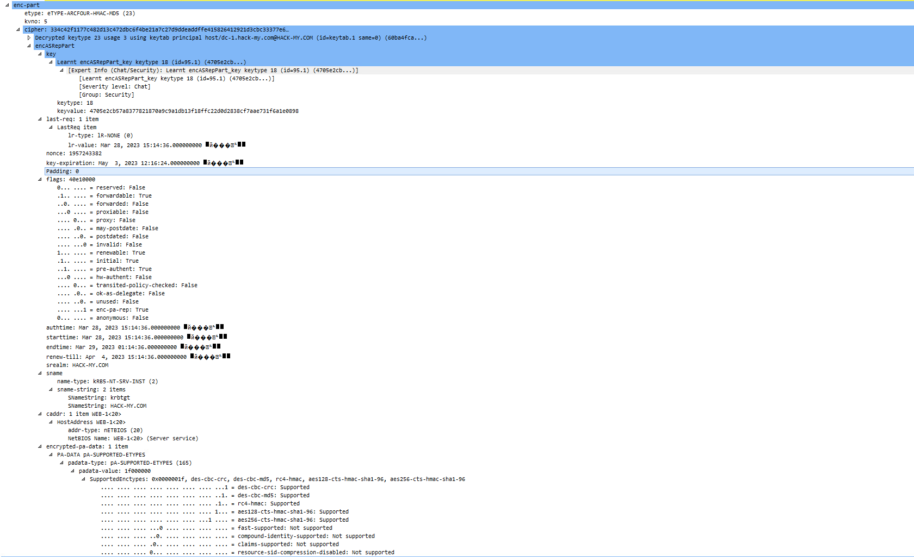

# Kerberos

Kerberos协议是由**MIT**提出的一种**网络身份验证协议**，是一种在**开放的非安全网络**中**认证并识别用户身份信息**的方法。它旨在**使用密钥加密技术**为**客户端**/**服务端应用程序**提供**强身份验证**。Kerberos英文单词为西方神话中守卫地狱之门的三头犬的名字，顾名思义，Kerberos需要**三方共同参**与才能**完成一次认证**。目前Kerberos主流版本为2005年RFC4120标准定义的**KerberosV5**。Windows、Linux、MacOS均支持Kerberos协议。

## Kerberos基础

在Kerberos中可以划分为3个主要角色：

* 访问服务的客户端：**Kerberos客户端代表需要访问资源的用户进行操作的应用程序**，例如打开文件、打印文档。每个Kerberos客户端在访问资源之前都会请求身份验证。
* 提供服务的服务端：域内提供服务的服务端。**服务端都有唯一的SPN**(服务主体名称)
* 提供认证服务的KDC：Key Distribution Center即**密钥分发中心**，**KDC是一种网络服务**，它向**活动目录域内**的**用户**和**计算机**提供**会话票据**和**临时会话密钥**，其服务**账户为krbtgt**。KDC作为活动目录域服务的一部分运行在每个域控制器上。

关于**kebtgt账户**，该用户是在**创建活动目录**时系统**自动创建**的一个账户，其作用是**KDC的服务账户**，其密码**由系统随机生成**，为**无法登录**的主机。

<figure><figcaption></figcaption></figure>

Kerberos是一种**基于票据(Ticket)**的认证方式，客户端想要**访问服务端的某个服务**，首**先需要购买服务端认可的ST**(Service Ticket，**服务票据**)。也就是说，**客户端**在**访问服务**之前需要**先购好票**，等待服务验票之后才能访问。但这**票并不能直接购买**，而是**需要一张TGT**(Ticket Granting Ticket，**认购认证**)。也就是说**获取ST之前需要先获取一张TGT**。**ST与TGT均由KDC发放**，而因为KDC运行在域控上，又可以说成均由域控发放。

Kerberos使用TCP/UPD **88端口进行认证**，使用TCP/UDP **464端口进行密码重置**

<figure><figcaption></figcaption></figure>

## PAC

**PAC包含各种授权信息、附加凭证信息、配置文件和策略信息等**，例如用户所属的用户组、用户所具有的权限等。在最初的RFC1510规定标准的Kerberos认证过程并没有PAC，微软在自己的产品所实现的Kerberos流程中加入了PAC的概念。由于在域中不同权限的用户能够访问的资源是不同的，因此微软设计**PAC用来辨别用户身份和权限**

正常Kerberos认证流程中，**KDC返回的ST和TGT都是带有PAC的**，好处是以后对资源的访问中，服务端接收到客户请求的时候不需要再借助KDC提供完整的授权信息来完成对用户权限的判断，只需要根据请求中所包含的**PAC信息直接与本地ACL相比做出裁决**。

#### PAC结构

参考资料：Windows 数据类型

* [https://learn.microsoft.com/zh-cn/windows/win32/winprog/windows-data-types?redirectedfrom=MSDN](https://learn.microsoft.com/zh-cn/windows/win32/winprog/windows-data-types?redirectedfrom=MSDN)

PAC顶部结构如下:

```
typedef unsigned long ULONG;
typedef unsigned short USHORT;
typedef unsigned long64 ULONG64;
typedef unsigned char UCHAR;
 
 
typedef struct _PACTYPE {
    ULONG cBuffers;
    ULONG Version;                         
    PAC_INFO_BUFFER Buffers[1];
} PACTYPE;
```

* cBuffers：包含数组缓冲区中的条目数
* Version：版本
* **Buffers**：**包含一个PAC\_INFO\_BUFFER结构的数组**

重要部分：PAC\_INFO\_BUFFER结构如下：

```cpp
typedef struct _PAC_INFO_BUFFER { 
   ULONG ulType;    
   ULONG cbBufferSize;    
   ULONG64 Offset;
}PAC_INFO_BUFFER;
```

* ulType：包含此缓冲区中的数据的类型。它可能是以下字段之一
  * **Logon info**(1)
  * Client Info Type (10)
  * UPN DNS info(12)
  * Server Checksum(6)
  * Privsvr Checksum(7)
* cbBufferSize：缓冲大小
* Offset：缓存偏移量

#### PAC凭证信息

Logon info类型的**PAC\_LOGON\_INFO**包含**Kerberos票据客户端的凭证信息**。**数据本身包含**在一个**KERP\_VALIDATION\_INFO结构中**，该结构是由**NDR编码**。NDR编码的输出被放置在Logon Info类型的PAC\_INFO\_BUFFER结构中。KERP\_VALIDATION\_INFO结构如下

```cpp
typedef struct _KERB_VALIDATION_INFO {
    FILETIME Reserved0;
    FILETIME Reserved1;
    FILETIME KickOffTime;
    FILETIME Reserved2;
    FILETIME Reserved3;
    FILETIME Reserved4;
    UNICODE_STRING Reserved5;
    UNICODE_STRING Reserved6;
    UNICODE_STRING Reserved7;
    UNICODE_STRING Reserved8;
    UNICODE_STRING Reserved9;
    UNICODE_STRING Reserved10;
    USHORT Reserved11;
    USHORT Reserved12;
    ULONG UserId;
    ULONG PrimaryGroupId;
    ULONG GroupCount;
    [size_is(GroupCount)] PGROUP_MEMBERSHIP GroupIds;
    ULONG UserFlags;
    ULONG Reserved13[4];
    UNICODE_STRING Reserved14;
    UNICODE_STRING Reserved15;
    PSID LogonDomainId;
    ULONG Reserved16[2];
    ULONG Reserved17;
    ULONG Reserved18[7];
    ULONG SidCount;
    [size_is(SidCount)] PKERB_SID_AND_ATTRIBUTES ExtraSids;
    PSID ResourceGroupDomainSid;
    ULONG ResourceGroupCount;
    [size_is(ResourceGroupCount)] PGROUP_MEMBERSHIP ResourceGroupIds;
} KERB_VALIDATION_INFOC
```

部分重要字段如下：

* Acct Name：对应的值为用户sAMAccountName属性值
* Full Name：对应的值为用户displayName的值
* User RID：对应的值为用户的RID，也就是用户SID的最后部分
* Group RID：域用户的Group RID恒为513(也就是Domain Users的RID)，机器用户的Group RID恒为515(也就是Domain Computers的RID)，域控的Group RID恒为516(也就是Domain Controllers的RID)
* Num RIDS：用户所属组的个数
* GroupIDS：用户所属所有组的RID

#### PAC签名

PAC中包含两个数字签名**：PAC\_SERVER\_CHECKSUM** 和 **PAC\_PRIVSVR\_CHECKSUM**

PAC\_SERVER\_CHECKSUM：使用**服务密钥进行签名**

PAC\_PRIVSVR\_CHECKSUM：使用**KDC密钥进行签名**

签名有两个原因：

1. 存在带有服务密钥的签名，以验证此PAC已由服务签名
2. 带有KDC密钥的签名是为了防止不受信任的服务用无效的PAC为自己伪造票据

这两个签名分别以**PAC\_SERVER\_CHECKSUM**和**PAC\_PRIVSVR\_CHECKSUM**类型的**PAC\_INFO\_BUFFER发送**。在PAC数据用于访问控制之前，**必须检查PAC\_SERVER\_CHECKSUM签名**。这将**验证客户端是否知道服务的密钥**。而PAC\_PRIVSVR\_CHECKSUM签名的验证是**可选**的，**默认不开启**。它**用于验证PAC是否由KDC签发**，而不是由KDC以外的具有访问服务密钥的第三方放入票据中。

签名包含在以下结构：

```
typedef struct _PAC_SIGNATURE_DATA {
    ULONG SignatureType;
    UCHAR Signature[1];     
} PAC_SIGNATURE_DATA, *PPAC_SIGNATURE_DATA;
```

* SignatureType：此字段包含用于创建签名的校验和的类型，校验和必须是一个键控的校验和。Signature：此字段由一个包含校验和数据的字节数组组成。字节的长度可以由包装PAC\_INFO\_BUFFER结构来决定。

#### KDC验证PAC签名

当**服务端收到**客户端发来的**AP-REQ消息**时，**只能校验PAC\_SERVER\_CHECKSUM签名**，而并不能校验PAC\_PRIVSVR\_CHECKSUM签名

因此，如果**需要校验PAC\_PRIVSVR\_CHECKSUM签名**，服务端还需要将客户端发来的**ST服务票据中的PAC签名发给KDC进行校验**。但是，由于**大部分服务默认并没有KDC验证PAC这一步**(需要将目标服务主机配置为**验证KDC PAC签名**，**默认未开启**)，因此服务端就无需将ST服务票据中的PAC签名发给KDC校验

这也是白银票据攻击能成功的前提，因为如果配置了需要验证PAC\_PRIVSVR\_CHECKSUM签名的话，服务端会将这个PAC的数字签名以**KRB\_VERIFY\_PAC**的消息通过**RPC协议**发送给KDC，KDC再将验证这个PAC的数字签名的结果以**RPC返回码**的形式发送给服务端，服务端就可以根据这个返回结果判断PAC的真实性和有效性了。 这样，就算攻击者拥有服务密钥，可以制作ST服务票据，也不能伪造KDC的PAC\_PRIVSVR\_CHECKSUM签名，自然就无法通过KDC的签名校验

根据微软官方文档的描述，若要开启KDC校验PAC，需要有以下条件：

* 应用程序具有SeTcbPrivilege权限：SeTcbPrivilege权限允许为用户帐户分配 "**作为操作系统的一部分**"。本地系统、网络服务和本地服务帐户都是由**windows定义的服务用户帐户**。每个帐户都有一组特定的特权。
*   应用程序是一个**服务**，验证KDC PAC签名的注册表项被设置为1，默认为0。修改方法如下：

    1. 启动注册表编辑器regedit.exe
    2. 找到以下子键：**HKEY\_LOCAL\_MACHINE\SYSTEM\CurrentControlSet\Control\Lsa\Kerberos\Parameters**
    3. 添加一个**ValidateKdcPacSignature**的键值(DWORD类型)。该值为0时，不会进行KDC PAC校验。该值为1时，会进行KDC PAC校验。因此可以将该值设置为1启用KDC PAC校验。


    <figure><figcaption></figcaption></figure>

对于验证KDC PAC签名这个注册表键值，有以下几点注意事项：

* 如果服务端并非一个服务程序，而是一个**普通应用程序**，它将**不受以上注册表的影响**，而**总是进行KDC PAC校验**。
* 如果服务端并非一个程序，而是一个**驱动**，其**认证过程在系统内核内完成**，它将**不受以上注册表的影响**，而**永不进行PAC校验**。
* 使用以上注册表项，需要在**Windows Server 2003 SP2**或更新的操作系统。
* 在运行Windows Server 2008或更新操作系统的服务器上，该注册表项的值缺省为0(**默认没有该ValidateKdcPacSignature键值**)，也就是**不进行KDC PAC校验**。
* 需要说明的是，注册在本地系统帐户下的服务无论如何配置，都不会触发KDC验证PAC签名。也就是说譬如**SMB、CIFS、HOST等服务无论如何都不会触发KDC验证PAC签名**。

**为什么默认情况下KDC不会验证PAC签名**：执行KDC验证PAC的，意味着在响应时间和带宽使用方面的成本。它需要带宽使用来在应用服务器和KDC之间传输请求和响应。这可能会导致大容量应用程序服务器中出现一些性能问题。在这样的环境中，用户身份验证可能会导致额外的网络延迟和大量的流量。因此，默认情况下，KDC不验证PAC签名。

#### PAC在Kerberos中的优缺点

正如上面所提到的那样，PAC的引入其实带来了很多的优点。客户端在访问网络资源的时候服务端不再需要向KDC查询授权信息， 而是直接在本地进行PAC信息与ACL的比较。从而节约了网络资源。

如图所示， 在没有PAC的情况下，Server与KDC之间必须进行用户授权信息的查询与返回 ：

<figure><figcaption></figcaption></figure>

当引入PAC之后则变成了如图所示：

<figure><figcaption></figcaption></figure>

但是，PAC的引入也是有缺点的，PAC在用户的认证阶段引入会**导致认证耗时过长**。Windows Kerberos客户端会通过**RPC调用KDC上的函数来验证PAC信息**，这时候用户会观察到在服务器端与KDC之间的RPC包流量的增加。而另一方面， 由于PAC是微软特有的一个特性，所以启用了PAC的域中将不支持装有其他操作系统的服务器， 制约了域配置的灵活性。并且在2014年，由于PAC的安全性导致产生了一个域内极其严重的提权漏洞**MS14-068**

## Kerberos认证流程

客户端(Clinet-1)：10.10.10.14

服务端(Web-1)：10.10.10.13

KDC(DC-1)：10.10.10.11

&#x20;整个Kerberos认证流程如下：

<figure><figcaption></figcaption></figure>

数据包如下：

<figure><figcaption></figcaption></figure>

### AS-REQ\&AS-REP

#### AS-REQ分析

当域内某个用户想要域内访问某个服务时，输入用户名和密码，本机就会向**KDC的AS**，**发送**一个**AS-REQ(认证请求)**，请求完整数据包如下：

<figure><figcaption></figcaption></figure>

**AS-REQ请求包包含关键信息**：

* 请求的用户名cname
* 域名realm
* Authenticator(用户密钥加密的时间戳)
* 请求的服务名sname
* 加密类型etype
* 其他信息，如版本号、消息类型、票据有效时间、是否包含PAC、协商选择等

**AS-REQ请求包部分字段解析**：

* PA-DATA pa-ENC-TIMESTAMP：**预认证**，用**用户Hash加密时间戳**作为**value**发送给KDC的AS。然后**KDC**从活动目录中**查询出用户的Hash**，使用**用户的Hash进行解密**，且**时间戳在一定的范围内**，则证明**认证通过**。由于使用用户密码Hash加密的时间戳，因此也造成了**哈希传递攻击**。
* PA-DATA pa-PAC-REQUEST：**启用PAC支持的扩展**。这里**value对应**的值为**True or false**，KDC根据**include-pac**的值来确定返回的票据中是否需要携带PAC。(上图include-pac为true，说明包含PAC)
* kdc-options：用于与**KDC协商**一些选择设置
* cname：请求的用户名，**用户名存在与否**，返回的包是有差异的，因此可以**用于枚举域内用户名**。当用户名存在时，**密码正确与否**返回的包也是有差异的，因此可以进行**密码喷洒**。
* realm：域名
* sname：请求的服务，包含type和value。在AS-REQ中sname始终为**krbtgt**

重点讲解PA-DATA pa-ENC-TIMESTAMP字段。在AS-REQ包中，只有PA-DATA pa-ENC-TIMESTAMP部分是加密的，这一部分属于预认证，称为**Authentication**。在impacket/krb5/Kerberosv5.py脚本加密算法如下中：

```python
if isinstance(nthash, bytes) and nthash != b'':
        key = Key(cipher.enctype, nthash)
    elif aesKey != b'':
        key = Key(cipher.enctype, aesKey)
    else:
        key = cipher.string_to_key(password, encryptionTypesData[enctype], None)

    if preAuth is True:
        if enctype in encryptionTypesData is False:
            raise Exception('No Encryption Data Available!')

        # Let's build the timestamp
        timeStamp = PA_ENC_TS_ENC()

        now = datetime.datetime.utcnow()
        timeStamp['patimestamp'] = KerberosTime.to_asn1(now)
        timeStamp['pausec'] = now.microsecond

        # Encrypt the shyte
        encodedTimeStamp = encoder.encode(timeStamp)

        # Key Usage 1
        # AS-REQ PA-ENC-TIMESTAMP padata timestamp, encrypted with the
        # client key (Section 5.2.7.2)
        encriptedTimeStamp = cipher.encrypt(key, 1, encodedTimeStamp, None)

        encryptedData = EncryptedData()
        encryptedData['etype'] = cipher.enctype
        encryptedData['cipher'] = encriptedTimeStamp
        encodedEncryptedData = encoder.encode(encryptedData)
```

patimestamp和pausec为解密后的值，解密内容如下：

<figure><figcaption></figcaption></figure>


#### AS-REP分析

当KDC的AS**接收**到客户端发来的**AS-REQ后**，AS会**从活动目录数据库**中**提取出该用户的密钥**，然后使用该密钥对请求包中的**预认证部分进行解密**，解密成功且时间戳在有效范围内，则证明请求者提供的用户密钥正确，完整的数据包如下：

<figure><figcaption></figcaption></figure>

**AS-REP请求包包含关键信息**：

* 版本号、域名、用户名等
* TGT
  * 版本号、域名、请求的服务名
  * enc-part加密部分(krbtgt密钥加密)
    * logon session key
    * 用户名、域名、认证时间、认证到期时间等
    * authorization-data
      * PAC\_SERVER\_CHECKSUM
      * PAC\_SERVER\_CHECKSUM
* Logon Session Key(用户密钥加密)

**AS-REP请求包部分字段解析**：

* ticket：认购权证票据
* enc-part(**ticket中**的)：TGT中的加密部分，这部分是**用Krbtgt的密码Hash加密**的，因此如果我们**拥有krbtgt用户的Hash**，则可以自己**制作一个ticket**，这就是**黄金票据**传递攻击。
* enc-part(最外层的)：**Logon Session Key**，这部分是用请求的用户密码Hash加密的，作为**下一个阶段的认证密钥**

在**AS-REP包**中最**重要**的就是**TGT**和**加密的Logon Session Key**。TGT中加密部分是使用krbtgt密钥加密的，而Logon Session Key是使用请求的用户密钥加密的。

1.  **TGT部分：**TGT中包含一些明文显示的信息，如版本号tkt-vno、域名realm、请求的服务名sname，但最重要的还是加密部分。加密部分是使用krbtgt账户密钥加密的，主要包含Logon Session Key、请求的用户名cname、域名crealm、认证时间authtime、认证到期时间endtime、authorization-data等信息，其中authorization-data部分包含客户端的身份权限等信息，这些信息包含在PAC中，如下图


    <figure><figcaption></figcaption></figure>

    TGT下**authorization-data**字段下代表用户身份权限的PAC解密包如下，主要还是通过**User RID**和**Group RID**来辨别用户权限的


    <figure><figcaption></figcaption></figure>

    **KDC生成PAC的过程如下：**KDC在收到客户端发来的AS-REQ后，从请求中**取出cname**字段，然后**查询活动目录数据库**，找到sAMAccountName属性为cname字段的值的用户，用该用户的身份生成一个对应的PAC
2.  **Logon Session Key：**AS-REP包中最外层的部分就是加密的Logon Session Key，用于确保客户端和KDC一阶段的通信安全，使用请求的用户密钥加密，解密内容如下：


    <figure><figcaption></figcaption></figure>

    主要包含认证时间authtime、认证到期时间endtime、域名srealm、请求的服务名sname、协商标志flag等信息，另外，在**TGT中也包含Logon session key**

### TGS-REQ\&TGS-REP


### AP-REQ\&AP-REP

### S4u2Self\&S4u2Proxy

## Kerberos协议安全问题

