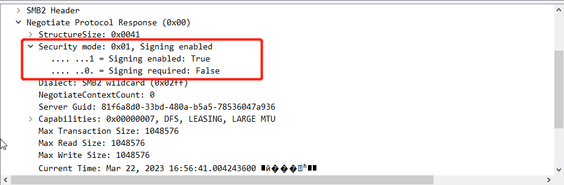

# NTLM

## 目录

* [NTLM协议以及存在的意义](ntlm.md#ntlm-xie-yi-yi-ji-cun-zai-de-yi-yi)
* [SSPI与SSP的概念](ntlm.md#sspi-yu-ssp-de-gai-nian)
* [LM Hash 加密算法](ntlm.md#lm-hash-jia-mi-suan-fa)
* [NTLM Hash 加密算法](ntlm.md#ntlm-hash-jia-mi-suan-fa)
* [系统层面的NTLM Hash](ntlm.md#xi-tong-ceng-mian-de-ntlm-hash)
* [NTLM协议认证](ntlm.md#ntlm-xie-yi-ren-zheng)
  * [工作组环境下的NTLM认证](ntlm.md#gong-zuo-zu-huan-jing-xia-de-ntlm-ren-zheng)
  * [实操环境理解工作组环境下的NTLM认证](ntlm.md#shi-cao-huan-jing-li-jie-gong-zuo-zu-huan-jing-xia-de-ntlm-ren-zheng)
  * [数据包剖析之协商部分](ntlm.md#shu-ju-bao-pou-xi-zhi-xie-shang-bu-fen)
  * [数据包剖析之Net-NTLM v2 Hash计算](ntlm.md#shu-ju-bao-pou-xi-zhi-netntlm-v2-hash-ji-suan)
  * [域环境下的NTLM认证](ntlm.md#yu-huan-jing-xia-de-ntlm-ren-zheng)
  * [实操环境理解域环境下的NTLM认证](ntlm.md#shi-cao-huan-jing-li-jie-yu-huan-jing-xia-de-ntlm-ren-zheng)
  * [NTLM v1和NTLM v2的区别](ntlm.md#ntlm-v1-he-ntlm-v2-de-qu-bie)
  * [LmCompatibilityLevel](ntlm.md#lmcompatibilitylevel)
* [NTLM协议带来的安全问题](ntlm.md#ntlm-xie-yi-dai-lai-de-an-quan-wen-ti)

### NTLM协议以及存在的意义

NTML(New Technology LAN Manager)是微软用于**Windows身份验证的主要协议之一**

早期SMB协议以明文口令的形式在网络上传输，因此出现了**LM协议(LAN Manager)**，由于太简单，容易被破解，因为又推出了**NTLM协议**，以及**更新NTLM第2版**，NTLM协议可用于**工作组的机器身份验证**，又可与用于**域环境身份验证**，还可以为**服务应用提供身份验证**。

### SSPI与SSP的概念

SSPI(Security Service Provider interface)为Windows定义的一套接口，接口定义了与安全有关的功能函数，包括但不限于：

* 身份验证机制
* 为其他协议提供的**Session Security(会话安全)机制**，Session Security(会话安全)可**为通信提供数据的完整性校验**以及**数据的加解密功能**
* SSPI只是定义了一套接口函数，**并没有实现具体内容**

SSP(Security Service Provide)是**SSPI的实现者**，微软自己实现了很多SSP用于提供安全功能，如

* NTLM SSP：**WIndows NT 3.51中引入(msv1\_0.dll)**,为**WIndows 2000之前的**客户端到服务器域和非域身份验证(**SMB/CIFS**)提供**NTLM质询/响应身份验证**
* Kerberos SSP：**WIndows 2000中引入**，**Windows vista中更新为支持AES**，为WIndows 2000及更高版本中首选的客户端-服务器域**提供相互身份验证**
* Digest SSP.........................

因为SSPI中定义了与Session Security有关的API，所以上层应用利用任何SSP与远程的服务进行身份验证后，此SSP都会为本次链接**生成一个随机的Key**，这个随机Key被称为**Session Key**。上层应用经过身份验证后，可以选择性使用这个Key对之后**发往服务端或接受自服务端的数据进行签名或加密**。在**系统层面，SSP就是一个dll**,用来实现**身份验证**等安全功能。不同的SSP实现的身份验证机制不一样，比如NTLM SSP实现的是一种质询/响应的身份验证机制，Kerberos SSP实现的是基于Ticket(票据)的身份验证机制，我们可以编写自己的SSP，然后注册到操作系统中，让操作系统支持我们自定义的身份验证方法。

### LM Hash 加密算法

LM是微软推出的一个身份认证协议，使用的加密算法为LM hash ，**LM Hash本质是DES加密**，尽管LM hash容易被破解，但是为了保证系统的兼容性，**WIndows只是将LM hash禁止**(从Windows vista和Windows server 2008开始默认禁用LM Hash)。

LM hash明文密码被限定在14位以内，也就是要停止使用LM hash，将用户密码设置为14位以上即可，如果LM hash的值为**aad3b435b51404eeaad3b435b51404ee**，说明**LM hash为空值或被禁用了**。

LM hash加密流程为(以密码：P@ssW0rd!为例)

1.  将用户的明文口令转换为大写，再转换为十六进制

    P@ssW0rd! -> P@SSW0RD! -> 504053535730524421
2.  如果转换后的十六进制字符串长度不足14B(长度28)，则用0来补全

    504053535730524421 -> 不足14B(长度28)，则用0来补全 -> 5040535357305244210000000000
3.  将14B分为两组，每组7B，然后转为二进制数据，每组2进制数据为56bit

    第一组：50405353573052

    二进制为：01010000010000000101001101010011010101110011000001010010

    第二组：44210000000000

    二进制为：01000100001000010000000000000000000000000000000000000000
4.  将每组二进制按7bit为一组，分为8组，每组末尾加0，再转换成十六进制，成为8B长度的十六进制

    第一组：0101000、0010000、0001010、0110101、0011010、1011100、1100000、1010010

    每组末尾加0：01010000、00100000、00010100、01101010、00110100、10111000、11000000、10100100

    转换为十六进制：5020146a34b8c0a4

    第二组：0100010、0001000、0100000、0000000、0000000、0000000、0000000、0000000

    每组末尾加0：01000100、00010000、01000000、00000000、00000000、00000000、00000000、00000000

    转换为十六进制：4410400000000000
5.  将上面生成的两组8B的十六进制数据分别作为DES加密密钥对字符串"KGS!@#$%"进行加密，然后将DES加密后的两组密文进行拼接(需要对KGS!@#$%进行16进制转换)，得出LM hash

    第一组：KGS!@#$%(明文) 5020146a34b8c0a4(密钥) -> DES 加密 -> 921988BA001DC8E1

    第二组：KGS!@#$%(明文) 4410400000000000(密钥) -> DES 加密 -> 22C34254E51BFF62

    拼接：921988BA001DC8E122C34254E51BFF62

.png>).png>)

### NTLM Hash 加密算法

为了解决LM hash加密和身份验证方案固有的安全弱点，在1993年**Windows NT 3.1**中首次引入了**NTLM hash**，如下表格，也就是从**Windows vista**和**Windows server 2008**开始，默认禁用了LM Hash，即为空**aad3b435b51404eeaad3b435b51404ee**，只存储NTLM hash

|                     |  LM | NTLM |
| ------------------- | :-: | :--: |
| Windows 2000        |  √  |   √  |
| Windows XP          |  √  |   √  |
| Windows Server 2003 |  √  |   √  |
| Windows Vista       |     |   √  |
| Windows 7           |     |   √  |
| Windows Server 2008 |     |   √  |
| Windows 8           |     |   √  |
| Windows Server 2012 |     |   √  |

NTLM Hash为提高安全性同时保证兼容性而设计的散列加密算法，其基于MD4加密算法进行加密，以P@ssW0rd!为例，加密流程为：

1.  将密码采用UTF-16LE(小尾序)进行Hex code

    P@ssW0rd! -> Hex code(UTF-16LE)编码转换 -> 500040007300730057003000720064002100
2.  对 Hex code(UTF-16LE)编码后的字符串进行标准的MD4单向Hash加密

    500040007300730057003000720064002100 -> Md4加密 -> a8f33bee89eba84d289ab51248f1534b

<figure><figcaption></figcaption></figure>

### 系统层面的NTLM Hash

用户的密码经过NTLM Hash加密后存储在**C:\WIndows\system32\config\SAM**文件中

用户输入的密码进行本地认证的过程，所有操作都是在**本地进行**，系统会将用户输入的密码转换为NTLM Hash然后与SAM文件中的NTLM Hash进行比较，相同则说明密码正确，系统层面流程为：

1. 用户注销、重启、锁屏后，系统启动**winlogon.exe**显示登录界面，也就是输入框
2. winlogon.exe接受输入后，将密码转交给**Isass.exe**进程
3. isass.exe进程会存一份明文密码，将明文密码加密成**NTLM Hash**，与SAM文件数据库进行比较和认证

以WIndows Server 2008为例使用MSf或CS转储抓到的Hash密码格式为：

Administrator:500:aad3b435b51404eeaad3b435b51404ee:03677e5a8d9157df3214cd324437f063:::

即用户名:用户SID值:LM Hash:NTLM Hash:::，其中由于默认禁用了LM Hash，所以LM Hash固定为空即aad3b435b51404eeaad3b435b51404ee

### NTLM协议认证

NTLM协议是一种基于Challenge/Response(质询/响应)的验证机制，由三种类型消息组成：

* Type 1 (协商，Negotiate)
* Type 2 (质询，Challenge)
* Type 3 (认证，Authentication)

NTLM协议分NTLM v1 和NTLM v2两个版本，目前使用最多的为**NTLM v2**，NTLM v1 与 NTLM v2最显著的区别就是**Challenge值与加密算法不同**，共同之处是都使用**NTLM Hash进行加密**。

#### **工作组环境下的NTLM认证:**

<figure><figcaption><p>工作组环境下的NTLM认证流程</p></figcaption></figure>

1. 当客户端需要访问服务器某个服务时，就需要**进行身份认证**，于是在客户端输入服务器的用户名与密码进行验证之后，就会**缓存服务器的密码NTLM Hash值**，然后客户端会**向服务端发送一个请求**，该请求**利用NTLM SSP**生成**NTLMSSP\_NEGOTIATE消息**，也就是**Type 1**协商消息
2. 服务端接收到客户端发送过来的Type 1消息后，读取其中内容，并从中选择自己能接受的服务内容、加密等级、安全服务等，然后传**输给NTLM SSP**，得到**NTLMSSP\_CHALLENGE消息**，也就是**Type 2**质询消息，并将**Type 2消息发回给客户端**。在Type 2 消息中包含一个服务端生成的16位随机值，被称为**Challenge值**，**服务端会将该Challenge值进行缓存**
3. 客户端收到服务端返回的Type 2消息后，读取服务端支持的内容，**并取出其中的Challenge值**，用缓存的服务器密码**NTLM Hash对其中进行加密得到Response消息**。最后将**Response**和一些其他消息封装到**NTLMSSP\_AUTH消息中**，也就是**Type 3认**证消息，然后发送到服务端
4. 服务端收到认证消息后，从中取出**Net-NTLM Hash**，然后利用自己密码的**NTLM Hash**对**Challenge**值进行一系列加密运算。得到自己计算的**Net-NTLM Hash**,然后进行判断，相等则认证成功。

#### **实操环境理解工作组环境下的NTLM认证**

* 客户端(Windows server 2016)：172.168.1.2
* 服务端(Windows 7)：172.168.1.1

登录成功数据包如下：

<figure><figcaption><p>net use登录成功</p></figcaption></figure>

登录失败数据包如下：

<figure><figcaption><p>net use登录失败</p></figcaption></figure>

NTLM认证的数据包都会放在GSS-Api里面，如图

<figure><figcaption><p>SMB认证包之一</p></figcaption></figure>

关于**GSS-API**(Generic Security Service Application Program Interface)，是一种统一的模式，为使用者提供与机制无关、平台无关、程序语言环境无关并且可移植的安全服务，让程序员编写应用程序时可以应用通用的安全机制。

SSPI是GSS-API一个专有变体，进行了扩展并具有许多特定于WIndows的数据类型，SSPI生成和接受的令牌大多与GSS-API兼容，而这里NTLM SSP实现了SSPI，因此也相当于实现了GSS-API。注册为SSP的一个好处就是SSP实现了与安全有关的功能函数，因此上层协议(SMB\HTTP\LDAP)在使用身份认证等功能时，可以不用考虑协议细节，只需要调用相关函数即可，而认证过程中的流量嵌入上层协议中。(Kerberos既可以嵌在上层协议中，也可以作为独立应用层协议)

#### **数据包剖析之协商部分**

**NTLM认证前4个包：**

<figure><figcaption></figcaption></figure>

前4个包主要为协议协商的一些信息，重点为**Security mode**(安全模式)，即如图下，Security mode下**Signing enabled 为True**，**Signing required为False**，表面当前客户端虽然支持签名，但是协商不签名(工作组环境默认均不签名)

<figure><figcaption></figcaption></figure>

**第五个包NTLMSSP\_NEGOTIATE 即Type1：**

<figure><figcaption><p>NTLMSSP_NEGOTIATE</p></figcaption></figure>

用于从客户端发送到服务端启动NTLM身份验证的包，主要目的是通过flag指示支持的选择来验证基本规则，Type1 NEGOTIATE包核心部分如下：

<figure><figcaption><p>Type1 NEGOTIATE</p></figcaption></figure>

Negotiate Flags字段为需要协商的flag标志

<figure><figcaption></figcaption></figure>

**第六个包NTLMSSP\_CHALLENGE 即Type2**

<figure><figcaption></figcaption></figure>

第六个包NTLMSSP\_CHALLENGE为服务端发送给客户端的数据包，包含服务器支持和同意的功能列表，核心部分内容如下：

<figure><figcaption></figcaption></figure>

NTLMSSP\_CHALLENGE Type 2消息中包含**Challenge**的值，**在NTLM v2版本中，Challenge值为一个随机的16B字符串**，如图下的2069be96201d963f

<figure><figcaption></figcaption></figure>

**第7个包NTLMSSP\_ AUTH 即Type3**

<figure><figcaption></figcaption></figure>

第7个包为NTLMSSP\_ AUTH 即Type 3 Authentication消息，用于客户端发送给服务端的认证的消息，此消息还包含客户端对Type 2质询消息的效应，表明客户端知道账户和密码，Type 3 Authentication消息还会指示身份验证的身份验证目标(域或服务器名字)和用户名，以及客户端工作站名，核心部分如下：

<figure><figcaption></figcaption></figure>

Authentication消息中最主要的是**Response消息**，**Response消息是用服务器密码的NTLM Hash加密Challenge值后经过一系列运算得到的**，Response消息可以提出取**Net-NTLM Hash**，在Response消息中，分别有以下6种类型响应：

* LM响应：由低版本客户端发送，这是原始的效应内型
* NTLM v1响应：基于NT的客户端发送的，包括Windows 2000与XP
* NTLM v2响应：Windows NT Service Pack 4中引入的一种较新的响应内型，替换启用了NTLM v2系统上的NTLM 响应
* LM v2响应：替换NTLM v2系统上的LM响应
* **NTLM v2** 会话响应：用于没有NTLM v2身份验证的情况下协商NTLM v2会话安全性，此方案会更改LM NTLM效应的语义
* 匿名响应：当匿名上下文正在建立时使用；没有提供实际的证书；没有真正的身份效应；"存根"字段显示在Type 3消息中

6种效应使用的加密流程一样，都是Challenge/Response验证机制，不同之处在于Challenge值和加密算法不同，至于选择哪个版本的响应，由**LmCompatibilityLevel**决定(后面会解释)

如图下，在Type 3消息数据包中Response消息中是NTLM v2的响应类型，且可以看到在NTLMv2 Response消息下的**NTProofStr**字段，该字段的值用做数据签名的Hash(**HMAC-MD5**)值，目的是保证数据的完整性

<figure><figcaption></figcaption></figure>

对于NTLM v2 Hash 与 NTProofStr，计算公式为

```
NTLM v2 Hash = HMAC-MD5(unicode(hex((upper(UserName)+DomainName))),NLTM Hash)
NTProofStr = HMAC-MD5(challenge+blob,NTLMv2 Hash)
```

微软为防止数据包中途被篡改，使用了**exportedSessionKey**加密3个NTLM消息来保证数据包的完整性，而由于**exportedSessionKey**仅对启动认证的账户和目标服务器已知，因此有了MIC，攻击者就无法中途篡改NTLM认证数据包了，MIC计算公式如下：

```
MIC = HMAC_MD5(exportedSessionKey,NEGOTIATE_MESSAGE + CHALLENGE_MESSAGE + AUTHENTICATE_MESSAGE)
```

**第八个数据包为返回结果Session Setup Response即为认证成功**

<figure><figcaption></figcaption></figure>

认证完成后，根据协商字段值来确定是否需要对后续数据包进行签名。

在第七个数据包中的**Session Key**字段就是用于协商加密密钥的

<figure><figcaption></figcaption></figure>

从Impacket中ntlm.py脚本来分析Session Key如何生成与发挥作用，定位到ntlm.py脚本中的generateEncryptedSessionKey函数，**Session Key**是由**keyExchangeKey**和**exportedSessionKey**经过一系列运算得到的

```python
def generateEncryptedSessionKey(keyExchangeKey, exportedSessionKey):
   cipher = ARC4.new(keyExchangeKey)
   cipher_encrypt = cipher.encrypt

   sessionKey = cipher_encrypt(exportedSessionKey)
   return sessionKey

```

在KXKEY函数中，可以分析出keyExchangeKey是由password和server-Challenge等值经过一系列运算得到的。

```python
def KXKEY(flags, sessionBaseKey, lmChallengeResponse, serverChallenge, password, lmhash, nthash, use_ntlmv2 = USE_NTLMv2):
   if use_ntlmv2:
       return sessionBaseKey

   if flags & NTLMSSP_NEGOTIATE_EXTENDED_SESSIONSECURITY:
       if flags & NTLMSSP_NEGOTIATE_NTLM:
          keyExchangeKey = hmac_md5(sessionBaseKey, serverChallenge + lmChallengeResponse[:8])
       else:
          keyExchangeKey = sessionBaseKey
   elif flags & NTLMSSP_NEGOTIATE_NTLM:
       if flags & NTLMSSP_NEGOTIATE_LM_KEY:
           keyExchangeKey = __DES_block(LMOWFv1(password, lmhash)[:7], lmChallengeResponse[:8]) + __DES_block(
               LMOWFv1(password, lmhash)[7] + b'\xBD\xBD\xBD\xBD\xBD\xBD', lmChallengeResponse[:8])
       elif flags & NTLMSSP_REQUEST_NON_NT_SESSION_KEY:
          keyExchangeKey = LMOWFv1(password,lmhash)[:8] + b'\x00'*8
       else:
          keyExchangeKey = sessionBaseKey
   else:
       raise Exception("Can't create a valid KXKEY!")

   return keyExchangeKey
  
```

而exportedSessionKey是客户端生成的随机数，用于加解密流量

```python
exportedSessionKey = b("".join([random.choice(string.digits+string.ascii_letters) for _ in range(16)]))
```

客户端会生成一个随机数exportedSessionKey，并且后续都使用exportedSessionKey来加解密流量，但exportedSessionKey是客户端生成的，服务端并不知道

所以整个客户端和服务端通过的Session Key协商密钥的流程为

1. 客户端使用keyExchangeKey作为Key，用RC4加密算法加密exportedSessionKey，得到了流量中看到的Session Key
2. 服务端拿到流量后，使用用户密码和Challenge值经过运算生成了keyExchangeKey，然后使用Session Key与keyExchangeKey一起运算得到了exportedSessionKey，最后使用exportedSessionKey加解密流量

对于攻击者来说，由于没有用户的密码，因此无法生成keyExchangeKey，所以即使拿到流量，也无法计算出exportedSessionKey，自然也无法解密

#### **数据包剖析之Net-NTLM v2 Hash计算**

先分析NTLM v2中的Response消息生成流程：

1. 将大写的User name与Domain name(区分大小写)拼在一起进行**十六进制转换**，然后**双字节Unicode编码得到了data**，接着使用**16B NTLM哈希值作为密钥Key**，用**data和key进行HMAC-MD5加密**得到了**NTLM v2 Hash**
2. 构建一个blob信息
3. 使用16字节的NTLM v2 Hash作为密钥，将HMAC-MD5消息认证代码算法加密一个值(来自Type 2的Challenge与blob拼接在一起)，得到了一个16N的NTProofStr(HMAC-MD5)
4. 将NTProofStr与blob拼接起来得到Response

平时使用Response工具抓取NTLM Response消息的时候，抓取的都是Net-NTLM Hash格式的数据

Net-NTLM v2 Hash格式为：username::domain:challenge:HMAC-MD5-blob

* username：要访问的服务器用户名
* domain：域信息
* challenge：数据包6中服务器返回的challenge值
* HMAC-MD5：数据包7中的NTProofStr
* blob：**对应数据为数据包7中的NTLMv2 Response去掉NTProofStr的后半部分**

即NTLM v2 Hash与NTProofStr计算公式为：

```
NTLM v2 Hash = HMAC-MD5(unicode(hex((upper(UserName)+DomainName))),NTLM hash)
NTProofStr = HMAC-MD5(challenge+blob,NTLM v2 Hash)
```

即计算NTLM v2 Hash、NTProofStr以及Response值脚本如下

```python
#coding=utf-8
import hmac
import hashlib
import binascii

def str_to_hex(string):
    return ' '.join([hex(ord(t)).replace('0x','') for t in string])

def hex_to_unicode(string):
    return string.replace(" ", "00")+"00"

def Ntlm_hash(string):
    return binascii.hexlify(hashlib.new("md4",string.encode("utf-16le")).digest()).decode("utf-8")

def hmac_md5(key,data):
    return hmac.new(binascii.a2b_hex(key),binascii.a2b_hex(data),hashlib.md5).hexdigest()
    
if __name__ == "__main__":
    username = input ("please input Username: ")
    password = input ("please input Password: ")
    domain_name = input ("please input Domain name: ")
    challenge = input ("please input Challenge: ")
    blob = input ("please input blob: ")
    print( "*"*100)
    HEX = str_to_hex(username.upper() +domain_name)
    data = hex_to_unicode(HEX)
    key = Ntlm_hash(password)
    NTLM_v2_Hash = hmac_md5(key,data)
    print ("NTLM_V2_Hash: "+NTLM_v2_Hash)
    data2 = challenge+blob
    NTProofStr = hmac_md5(NTLM_v2_Hash,data2)
    print ("NTProofStr: "+NTProofStr)
    Response = username + "::"+ domain_name + ":" + challenge+":"+ NTProofStr+":"+blob
    print ("Response: "+Response)
```

<figure><figcaption></figcaption></figure>

#### 域环境下的NTLM认证

<figure><figcaption></figcaption></figure>

1. 当客户端需要访问服务器某个服务时，就需要进行身份认证，于是在客户端输入服务器的用户名与密码进行验证之后，就会缓存服务器的密码NTLM Hash值，然后客户端会向服务端发送一个请求，该请求利用NTLM SSP生成NTLMSSP\_NEGOTIATE消息，也就是Type 1协商消息
2. 服务端接收到客户端发送过来的Type 1消息后，读取其中内容，并从中选择自己能接受的服务内容、加密等级、安全服务等，然后传输给NTLM SSP，得到NTLMSSP\_CHALLENGE消息，也就是Type 2质询消息，并将Type 2消息发回给客户端。在Type 2 消息中包含一个服务端生成的16位随机值，被称为Challenge值，服务端会将该Challenge值进行缓存
3. .客户端收到服务端返回的Type 2消息后，读取服务端支持的内容，并取出其中的Challenge值，用缓存的服务器密码NTLM Hash对其中进行加密得到Response消息。最后将Response和一些其他消息封装到NTLMSSP\_AUTH消息中，也就是Type 3认证消息，然后发送到服务端
4. 服务端接收到客户端发来的NTLMSSP\_AUTH认证消息后，通过Netlogon协议与域控(DC)建立一个安全通道，将验证消息发送给域控
5. 域控收到服务端发来的验证消息后，从中取出Net-NTLM Hash，从数据库中找到该用户的NTLM Hash，对Challenge进行一系列加密运算，得出自己计算的Net-NTLM Hash，然后比对结果，并将结果发送给服务端
6. 服务端根据域控返回的结果，对客户端进行回复

#### **实操环境理解域环境下的NTLM认证**

客户端(Client1)：10.10.10.14

服务端(Web-1)：10.10.10.13

DC(DC-1)：10.10.10.11

<figure><figcaption></figcaption></figure>

字段含义与工作组中字段含义一致，不过多详述

#### NTLM v1和NTLM v2的区别

前面提到过NTLM v1和NTLM v2 都属于NTLM身份认证协议，区别在于Challenge值与加密算法不同，共同之处是都使用NTLM hash加密，具体区别如下：

1. Challenge值
   * NTLM v1：8B
   * NTLM v2：16B
2. Net-NTLM Hash使用的加密算法
   * NTLM v1：DES加密
   * NTLM v2：HMAC-MD5加密

NTLM v1 的Response消息生成规则如下：

1. 将16B的NTLM Hash填充为21B
2. 分成三组，每组7bit，作为3DES加密算法的三组密钥
3. 分别利用三组密码对服务端发来的Challenge值进行DES加密
4. 将这三个密文值连接起来得到Response

Net-NTLM v1 Hash格式为：username:hostname:LM Response:NTLM Response:challenge

#### LmCompatibilityLevel

在NTLMSSP\_AUTH包剖析提到过，6种效应使用的加密流程一样，都是Challenge/Response验证机制，不同之处在于Challenge值和加密算法不同，至于选择哪个版本的响应，由LmCompatibilityLevel决定的，其具体含义如下表：

| LmCompatibilityLevel值 | 具体含义                                                                                 |
| :-------------------: | ------------------------------------------------------------------------------------ |
|           0           | 客户端使用LM和NTLM身份认证，但从不使用NTLM v2会话安全性。域控接受LM、NTLM和NTLM v2身份验证                           |
|           1           | 客户端使用LM和NTLM身份验证，如果服务器支持NTLM v2会话安全性，则使用NTLM v2会话安全性。域控接受域控使用LM、NTLM和NTLM v2身份验证     |
|           2           | 客户端仅使用NTLM身份验证，如果服务器支持NTLM v2会话安全性，则使用NTLM v2会话安全性。域控使用LM、NTLM和NTLM v2身份验证           |
|           3           | 客户端仅使用NTLM v2身份验证，如果服务器支持NTLM v2会话安全性，则使用NTLM v2会话安全性。域控使用LM、NTLM和NTLM v2身份验证        |
|           4           | 客户端仅使用NTLM v2身份验证，如果服务器支持NTLM v2会话安全性，则使用NTLM v2会话安全性。域控拒绝LM身份验证，但接受NTLM和NTLM v2身份验证 |
|           5           | 客户端仅使用NTLM v2身份验证，如果服务器支持NTLM v2会话安全性，则使用NTLM v2会话安全性。域控拒绝LM和NTLM身份验证，但接受NTLM v2身份验证 |

LmCompatibilityLevel值是可以手动设置的：

* 通过本地安全策略设置(默认其值没有定义，无定义则使用默认值)：本地安全策略->安全设置->本地策略->安全选择->网络安全:LAN管理器身份验证

<figure><figcaption></figcaption></figure>

* 通过注册表设置(默认没有lmcompatibilitylevel字段)：计算机\HKEY\_LOCAL\_MACHINE\SYSTEM\CurrentControlSet\Control\Lsa\lmcompatibilitylevel，可通过新建lmcompatibilitylevel字段(REG\_DOWRD)填入数字0-5设置LmCompatibilityLevel值

### NTLM协议带来的安全问题

从NTLM认证的流程中可以分析出，在Type 3 NTLMSSP\_AUTH消息中，是可以使用用户密码Hash计算的，因此，当没有拿到用户的明文密码只拿到Hash的情况下，是可以进行Pass The Hash(PTH)哈希传递攻击。同样，还是在Type 3消息中，存在Net-NTLM Hash，当获得Net-NTLM Hash后，可以进行中间人攻击，重放Net-NTLM Hash，也就是NTLM Relay(NTLM中继)攻击。此外由于NTLM v1协议加密过程存在天然的缺陷，因此可以对Net-NTLM v1 Hash进行破解，得到NTLM Hash后横向移动。(**详细攻击手法后续会关联到此文章**)
